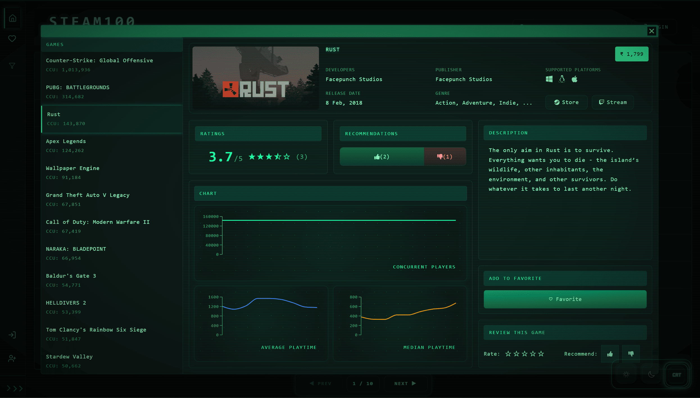
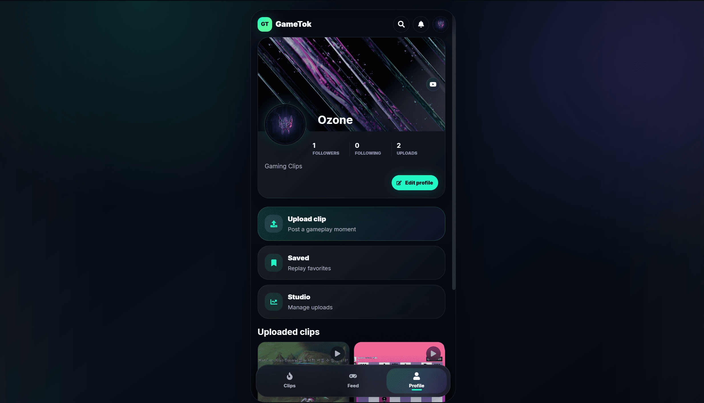
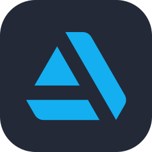

# Aditya Yewale  

**`Full Stack Developer • 3D Artist`**

Full Stack Developer focused on building modern, scalable, and user-focused web applications. I enjoy creating responsive interfaces, interactive frontend experiences, and clean application architecture using modern JavaScript technologies. Most of my work revolves around React, Next.js, Node.js, and MongoDB, with a strong interest in frontend engineering, UI/UX, and performance optimization. I like turning ideas into polished digital products while continuously exploring better workflows, design systems, and full stack development practices.

---

## Tech Stack

---

## Projects

<table>
<tr>
<td width="50%" align="center">

### <a href="https://github.com/AdityaYe/STEAM100-Dashboard" target="_blank">Steam100</a>

A Steam-inspired dashboard and game discovery experience built with a focus on sleek layouts, modern frontend design, and smooth browsing interactions.

<b>Tech Stack:</b> React, JavaScript, Tailwind CSS, API Integration

</td>

<td width="50%" align="center">

### <a href="https://github.com/AdityaYe/Game-Tok" target="_blank">GameTok</a>

A short-form gaming clip sharing platform focused on modern UI, responsive design, and interactive social features inspired by current content-driven applications.

<b>Tech Stack:</b> Next.js, React, Node.js, MongoDB, Tailwind CSS

</td>
</tr>
</table>

---

## My 3D Work 

I also have experience and a strong interest in 3D art, game asset creation, and real-time workflows. Over time, I’ve worked on stylized assets, hard-surface models, product visualizations, and environment-focused projects, which helped me develop a strong eye for visuals, presentation, and design detail.

### Tools & Software

<b>Also worked with:</b> Substance Painter, Quixel Mixer, Marmoset Toolbag
