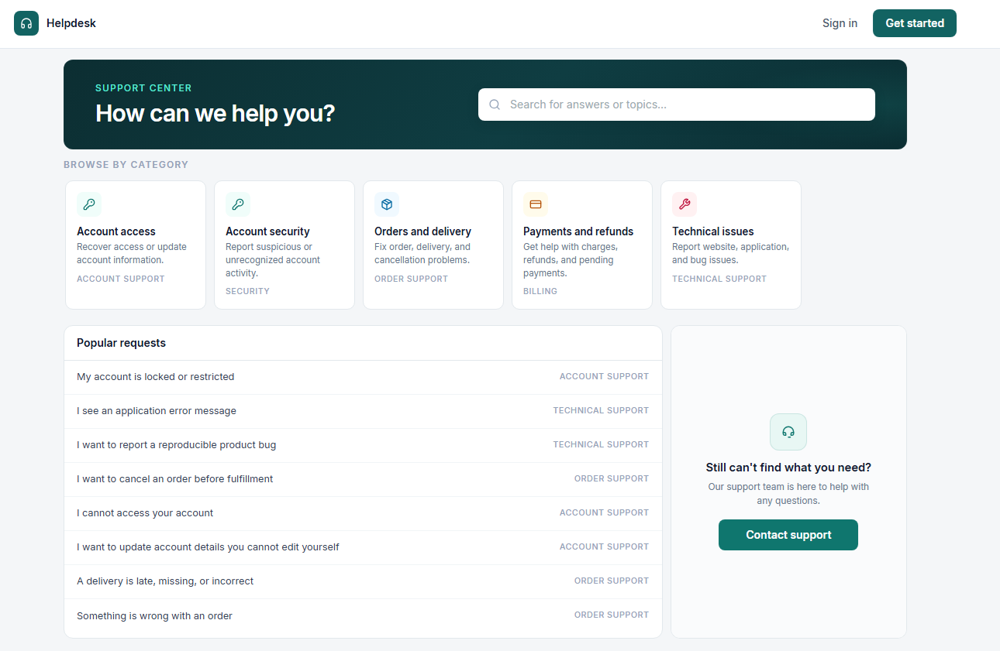
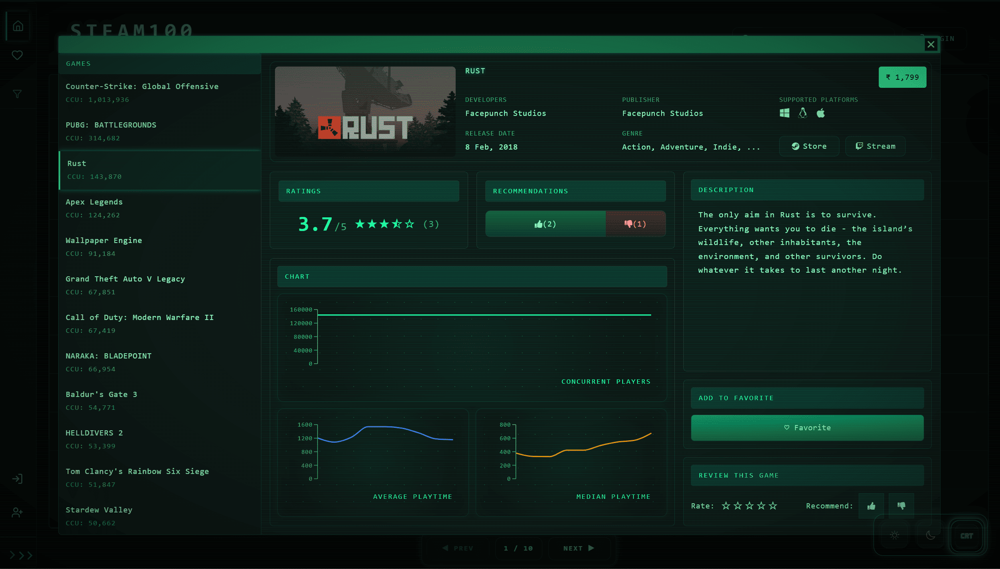
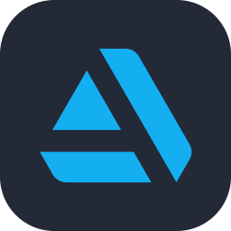

# Aditya Yewale  

**`Full-Stack Developer`**

Full-Stack Developer focused on building practical, production-oriented web applications using React, Next.js, TypeScript, Node.js, and Python. I enjoy working across frontend interfaces, backend APIs, databases, authentication, real-time systems, and background processing to turn ideas into complete applications.

My recent work includes a full-stack customer support platform with role-based access control, real-time notifications, SLA monitoring, Redis/BullMQ, cloud-hosted attachments, and email workflows.

---

## Tech Stack

---

## Projects

<table>
<tr>

<td width="50%" align="center">

### <a href="https://github.com/AdityaYe/customer-support-helpdesk" target="_blank">Helpdesk Support Portal</a>

A full-stack support platform with RBAC, ticket workflows, SLA monitoring,
real-time notifications, cloud attachments, and analytics.

<b>Tech Stack:</b> React, Node.js, Express, MongoDB, Redis, Socket.IO

 

<a href="https://customer-support-helpdesk-virid.vercel.app" target="_blank">
<b>Live Demo</b>
</a>

</td>

<td width="50%" align="center">

### <a href="https://github.com/AdityaYe/STEAM100-Dashboard" target="_blank">Steam100</a>

A Steam-inspired dashboard and game discovery experience focused on clean layouts, responsive design, API-driven content, filtering, and smooth browsing interactions.

<b>Tech Stack:</b> React, JavaScript, Tailwind CSS, API Integration

 

<a href="https://steam-100-dashboard.vercel.app/" target="_blank">
<b>Live Demo</b>
</a>

</td>

</tr>
</table>

---

## My 3D Work 

Before focusing on software development, I worked professionally in 3D art and visualization. That experience gave me a strong foundation in visual design, presentation, asset creation, and attention to detail.

I have worked on stylized assets, hard-surface models, product visualization, architectural visualization, and real-time workflows.

### Tools & Software

<b>Also worked with:</b> Substance Painter, Quixel Mixer, Marmoset Toolbag
